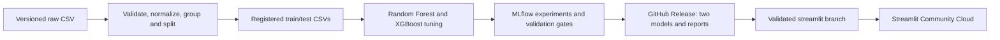

# Visit with Us: Wellness Tourism Purchase Prediction

A reproducible, CPU-only classification project using **GitHub + GitHub Actions + Streamlit Community Cloud**. This is the alternative workflow expressly permitted by the course announcement. No Hugging Face subscription or paid tracking server is needed.

## Architecture



- **Pre-contact:** 13 customer-profile features. Party size, children travelling and hotel preference are assumed already known.
- **Post-interaction:** the 13 profile fields plus contact method, pitch duration, follow-ups, product pitched and satisfaction.
- Identifiers, target and EDA-only columns never enter the classifier. The full fitted normalization/imputation/encoding/classifier pipeline is serialized for each stage.
- Fit/validation/test partitions are approximately 60/20/20 and shared between stages. Repeated customer IDs and identical raw feature records stay in the same group. Imputers and encoders are fitted within training CV, not globally.
- Average precision selects the model through 3-fold training CV. Validation F1 selects a threshold; test data is reserved for reporting. Both stages must beat their validation dummy baseline before publication.

## Windows Setup

Use Python 3.12. The inherited `.venv` was created on macOS and is not the Windows environment.

```powershell
py -3.12 -m venv .venv-win
.\.venv-win\Scripts\python.exe -m pip install -r requirements-dev.txt -e .
.\.venv-win\Scripts\python.exe -m ipykernel install --user --name wellness-tourism --display-name "Wellness Tourism (Python 3.12)"
```

Select **Wellness Tourism (Python 3.12)** in the notebook's kernel picker. Changing the VS Code Python interpreter does not necessarily switch an already-open notebook kernel.

On Linux/CI, create a Python 3.12 virtual environment and use its `python` executable for the same commands below.

## Prepare, Train, and Run

```powershell
.\.venv-win\Scripts\python.exe -m wellness_tourism.data --config config.json
.\.venv-win\Scripts\python.exe -m wellness_tourism.train --config config.json
.\.venv-win\Scripts\python.exe -m streamlit run app.py
```

The app runs at http://localhost:8501 unless that port is occupied. It supports a customer form and batch CSV scoring for both stages. Batch input is limited to 10 MB/10,000 rows; uploaded customer data is not persisted.

`--smoke` performs a tiny training search for integration checks. Smoke artifacts cannot be published and do not replace the local selected-model registry. Full runs are saved to `artifacts/runs/<run-id>/`; `artifacts/latest.json` points to the latest full report. A passing full run writes the local `models/registry.json`.

The notebook reuses that report rather than tuning twice. It trains through the shared API when no full run exists. Set `WELLNESS_RETRAIN=1` only when you intentionally want to rerun tuning. Changed data/configuration requires preparation and retraining before reporting.

## MLflow and Evaluation

```powershell
.\.venv-win\Scripts\mlflow.exe server --backend-store-uri sqlite:///artifacts/mlflow.db --host 127.0.0.1 --port 5000
```

Open http://localhost:5000. Each candidate parameter combination has a child run; the selected pipelines are logged and registered separately. Full CV tables, metrics, confusion matrices, PR/ROC curves and permutation importance are exported with each run. Set `MLFLOW_TRACKING_URI` only when using your own persistent tracking service. GitHub-hosted runners are ephemeral: release reports and model assets, not their SQLite database, are the persistent registry.

The initial local full run produced these held-out results (803 test rows):

| Stage | Selected model | Precision | Recall | F1 | ROC-AUC | Average precision |
|---|---|---:|---:|---:|---:|---:|
| Pre-contact | Random Forest | 0.699 | 0.741 | 0.719 | 0.918 | 0.768 |
| Post-interaction | Random Forest | 0.681 | 0.844 | 0.754 | 0.953 | 0.861 |

These are measured local results, not a guarantee for new customers. The executed notebook and each release's report are authoritative for subsequent runs.

## Verification

```powershell
.\.venv-win\Scripts\python.exe -m pytest -q
.\.venv-win\Scripts\python.exe -m ruff check wellness_tourism app.py scripts tests
.\.venv-win\Scripts\python.exe -m scripts.verify_release
.\.venv-win\Scripts\python.exe -m nbconvert --to notebook --execute --inplace data_analysis.ipynb --ExecutePreprocessor.kernel_name=wellness-tourism --ExecutePreprocessor.timeout=600
```

Tests build their own small models and run without cloud credentials. The workflow also validates on Windows and Linux. Model loading checks feature contracts, dependency versions and SHA-256 before deserialization. Only load registries and models generated by this trusted project: checksums do not make an arbitrary pickle safe.

## GitHub and Community Cloud

Configured repository: https://github.com/zfaida459-sudo/wellness_tourism_package_system

1. Commit the project source, dependencies, configuration, Dockerfile, notebook, tests, docs, workflow and authorized raw dataset to `main`. Do not include virtual environments, secrets, local artifact/MLflow stores, unrelated scratch files, or a local-path model registry. The workflow generates the published registry.
2. Ensure the repository is public, `main` is its default branch, and Actions can write contents as permitted by repository policy. The deployment job uses `GITHUB_TOKEN`, not a personal token. Branch protections must explicitly permit the approved bot updates; the script never bypasses them.
3. Run **Wellness tourism MLOps** from Actions, or push a relevant code/data/configuration change to `main`. PRs run read-only checks. Full main runs train, evaluate, execute the notebook and verify the Docker image before publishing.
4. A passing run creates a versioned GitHub Release, verifies the public model downloads, commits only generated data/reports/notebook/registry to `main`, then updates the managed `streamlit` branch. Runtime models use pinned release URLs, not `latest` or expiring Actions artifacts. Bot pushes do not recursively trigger Actions.
5. Once the first deployment branch exists, sign in at https://share.streamlit.io/, connect GitHub, create an app, and choose this repository, branch `streamlit`, entrypoint `app.py`, and Python 3.12. This initial account connection is a browser step. Later validated code/dependency pushes automatically update the app.
6. Record the actual app URL and successful run link in [docs/submission.md](docs/submission.md), along with genuine screenshots. No live app URL is claimed before deployment succeeds.

Preview the exact upload and branch-change allowlists without modifying GitHub:

```powershell
.\.venv-win\Scripts\python.exe -m scripts.deploy --dry-run --repo zfaida459-sudo/wellness_tourism_package_system
```

The explicit `--publish` mode additionally requires `GH_TOKEN` and the exact `--source-sha` (supplied by Actions). Keep secrets in GitHub settings, never in the notebook, source or chat. A stale `main`, failed validation gate, incompatible dependency or checksum mismatch blocks publishing. A pre-existing unmanaged `streamlit` branch is not overwritten.

**Rollback:** revert the faulty publication commit on the `streamlit` branch using a normal new Git commit, then push it. That restores the previous code, dependencies and pinned registry together; retain the referenced older GitHub Release. Do not force-push or delete the old release assets.

## Docker

Community Cloud runs the Python app directly; Docker is provided for portability and local/CI validation.

```powershell
docker build -t wellness-tourism .
docker run --rm -p 8501:8501 -v "${PWD}/models:/app/models:ro" wellness-tourism
```

For that launch, mount a **published** registry containing GitHub URLs, not machine-specific local artifact paths. Before publication, the CI-style inference check mounts the workspace and remaps the local run paths:

```powershell
docker run --rm -v "${PWD}:/workspace:ro" -w /workspace wellness-tourism python -m scripts.verify_release --container
```

The image runs as non-root, exposes port 8501, has a health check, and excludes datasets/secrets/notebooks from its build context. Docker Desktop's Linux engine must be running.

## Data and Limitations

The user-provided course CSV has 4,128 rows. Deterministic preparation removes 117 exact duplicate feature/target records, leaving 4,011 records and a purchase rate of approximately 19.3%. The supplied predictor columns have no missing values, but the pipelines support future missing values. See `data/manifest.json` for measured counts and hashes. This project does not invent a source license; confirm the original dataset's redistribution terms before publishing it publicly.

Historical `ProdTaken` is a proxy for the proposed wellness offering. No timestamp proves whether interaction fields preceded the outcome. Models describe associations, not the causal effect of a pitch or follow-up. Gender and other demographic fields deserve a separate fairness/governance review before operational marketing use. Scores are estimated, not guaranteed calibrated probabilities.

The inherited model artifact and scratch notebook are preserved but are not used by this implementation. No automatic marketing contact, new-customer logging, paid hosting, online learning or drift monitoring is included.